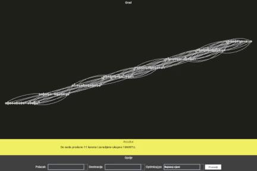

<h2>Introduction</h2>
The app offers a pathfinding solution with visual representation. The main graph represents a country, where each node is a city and directed edges between them represent departures or arrivals to that city with a particular vehicle at a particular time. This data is loaded from <code>transport_dataMP.json</code> or <code>transport_data.json</code> upon start.

<h2>Visual presentation</h2>
The app features a basic Swing-based UI with 3 distinct parts - the visual representation of the aforementioned graph, the "Rezultat" (result) bar and the "Opcije" (options) bar.

<h2>How to use</h2>
The options bar allows the user to select two nodes between which the pathfinder will attempt to find the most optimal path using criteria set with the "Optimizuj po" (optimize by) drop-dowm list of criteria. There are currently three possible criteria - "Najniza cijena" (lowest price), "Najkrace vrijeme puta" (shortest time to arrive) and "Najmanji broj presjedanja" (lowest number of vehicle changes). Using the data loaded earlier from the initial JSON file, the pathfinder will, upon pressing the "Pronadji" (find) button, visually display the pathfinding process, finishing when the most optimal path has been highlighted in its entirety.

<h2>Extras</h2>
After finding the optimal path, by pressing the "Detaljno" (detailed info) button, another window will open displaying the 5 most optimal paths (the most optimal one and 4 closest).

By selecting one, you'll be prompted to choose to buy a ticket with the "Kupi kartu" (buy ticket) button. Upon pressing said button, another window will open detailing the route even further, as well as the price and departure and arrival times.

By pressing the "Potvrdi kupovinu" (confirm purchase) button, a receipt will be printed and saved to your PC in a new directory created in the exact same directory the app jar was run from.

